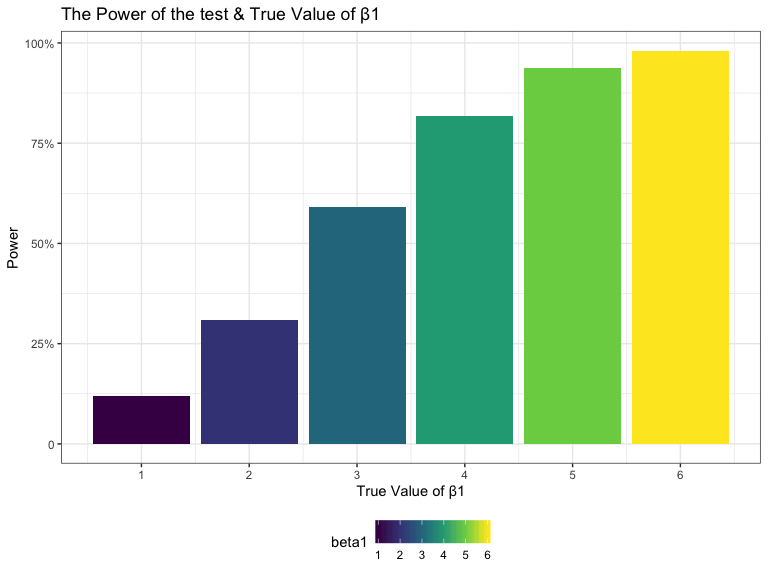

p8105\_hw5\_rw2708
================
Ran Wang
11/3/2019

## Probelm 1

``` r
#Read the data
iris_with_missing = iris %>% 
  map_df(~replace(.x, sample(1:150, 20), NA)) %>%
  mutate(Species = as.character(Species)) %>% 
  janitor::clean_names() 

iris_with_missing
```

    ## # A tibble: 150 x 5
    ##    sepal_length sepal_width petal_length petal_width species
    ##           <dbl>       <dbl>        <dbl>       <dbl> <chr>  
    ##  1          5.1         3.5          1.4         0.2 setosa 
    ##  2          4.9         3            1.4         0.2 setosa 
    ##  3          4.7         3.2          1.3         0.2 setosa 
    ##  4          4.6         3.1          1.5        NA   setosa 
    ##  5          5           3.6          1.4         0.2 setosa 
    ##  6          5.4         3.9          1.7         0.4 setosa 
    ##  7         NA           3.4          1.4         0.3 setosa 
    ##  8          5           3.4          1.5         0.2 setosa 
    ##  9          4.4         2.9          1.4         0.2 setosa 
    ## 10          4.9         3.1         NA           0.1 setosa 
    ## # … with 140 more rows

``` r
#Write a function to fill numeric and character variables 
replace_mean = function(x) { 
      if (is.numeric(x)) {
        non_na = x[!is.na(x)]
        x = replace(x, is.na(x), mean(non_na)) 
      } else if (is.character(x)) { 
        x = replace(x, is.na(x), "virginica") 
      }
      x
}

#Dataset without missing value
iris_without_missing = map_df(.x = iris_with_missing, ~replace_mean(.x)) %>% 
#round all numeric numbers to 1 decimal points
  mutate_if(is.numeric, round, digits = 1)

iris_without_missing 
```

    ## # A tibble: 150 x 5
    ##    sepal_length sepal_width petal_length petal_width species
    ##           <dbl>       <dbl>        <dbl>       <dbl> <chr>  
    ##  1          5.1         3.5          1.4         0.2 setosa 
    ##  2          4.9         3            1.4         0.2 setosa 
    ##  3          4.7         3.2          1.3         0.2 setosa 
    ##  4          4.6         3.1          1.5         1.2 setosa 
    ##  5          5           3.6          1.4         0.2 setosa 
    ##  6          5.4         3.9          1.7         0.4 setosa 
    ##  7          5.8         3.4          1.4         0.3 setosa 
    ##  8          5           3.4          1.5         0.2 setosa 
    ##  9          4.4         2.9          1.4         0.2 setosa 
    ## 10          4.9         3.1          3.8         0.1 setosa 
    ## # … with 140 more rows

The above dataset shows that the numerical missing values are filled
with with the mean of non-missing values and character missing values
are filled with “virginica”.

## Problem 2

``` r
#using the list.files function to list the names of all datasets 
zip_file <- list.files(path= "./hw5data/") 

#create a dataframe containing all file names and path
zip_file = tibble(group = zip_file) %>% 
  mutate(filenames= paste("./hw5data/", pull(., group), sep = "")) 
  
#Iterate over file names and read in data for each subject using purrr::map and saving the result as a new variable in the dataframe
zip_file_tidy = zip_file %>% 
#create a new variable to show the data for each file
mutate(new_variable = purrr::map(pull(.,filenames), read.csv)) %>% 
  select(group,new_variable) %>% 
#clean the group names by delete ".csv"
  mutate(group = str_replace(group,".csv","")) %>% 
#seperate the group variable to two new variables called control_arm and subject_id
  separate(group, into = c("control_arm","subject_id"), sep = "_") %>% 
#rename the control_arm
  mutate(control_arm = recode(control_arm, "con"="control", "exp"="experimental")) %>% 
  unnest(cols = new_variable)

#Make a spaghetti plot showing observations on each subject over time
plot_zip = zip_file_tidy %>% 
  pivot_longer(week_1:week_8,
               names_to = "week",
               values_to = "zip") %>% 
  separate(week, into = c("week_name","week_number"), sep = "_") %>% 
  select(-week_name) %>% 
  mutate(week = week_number,
         week = as.numeric(week)) %>% 
  select(-week_number) %>% 
   ggplot(aes(x = week, y = zip,color = subject_id)) +
  geom_line(aes(group = subject_id)) +
  facet_grid(.~control_arm) +
  labs(
    title = "Spaghetti plot for each subject over time",
    x = "Week",
    y = "Zip Value"
    ) +
    scale_x_continuous(
    # alteration for x-axis labels 
    breaks = c(0, 1, 2, 3, 4, 5, 6,7,8),
    labels = c("0", "1", "2", "3", "4", "5", "6","7","8")) +
    scale_color_discrete("Subject ID")
    
 plot_zip
```


As shown in the graph, the values maintain at the similar level in the
control groups from week 1 to week 8, but the values continuous to
increase in the experimental group over the same period. The result
suggests that the experiment would increase the value of
participants.

## Problem 3

``` r
#Write a function to calculate estimated beta 1 and the p value of the hypotheses test for beta 1 (sample size is fixed at 30 and beta 0 is fixed at 2)
sim_regression = function(beta1=0,n=30,beta0 = 2) {
  
  sim_data = tibble(
    x = rnorm (30, mean=0, sd=1),
    y = beta0 + beta1 * x + rnorm(30,0,sqrt(50))
  )
  
  ls_fit= lm(y~x, data = sim_data)
  regression_result = broom::tidy(ls_fit)
 
  
  tibble(
    beta1_hat = regression_result[[2,"estimate"]],
    p_value = regression_result[[2,"p.value"]]
  )
}

#Generate 10000 datasets from the model with the true beta 1 value from 1 to 6
sim_results = 
  tibble(beta1=c(1,2,3,4,5,6)) %>% 
  mutate(
    beta1_hat = map(.x = beta1, ~rerun(10000,sim_regression(beta1 = .x,n=30,beta0 = 2)))) %>% 
  unnest(col = "beta1_hat") %>% 
  unnest(col = "beta1_hat")


#Make a plot showing the proportion of times the null was rejected on the y axis and the true value of β2 on the x axis

plot1 = sim_results %>% 
  mutate(reject_null=case_when(p_value < 0.05 ~ "true",
                               TRUE ~ "false")) %>%
  #convert the true beta1 as factor for plotting
  mutate(beta1 = as.factor(beta1),
         beta1 = forcats::fct_relevel(beta1,c("1","2","3","4","5","6"))) %>% 
  #calculate the power at each level of true beta 1
  group_by(beta1, reject_null) %>% 
  summarize(power = n()/10000) %>% 
  filter(reject_null=="true") %>% 
  #Start to draw the plot
  ggplot(aes(x = beta1, y = power) ) + 
  geom_col(aes(fill = beta1)) +
   labs(
    title = "The Power of the test & True Value of β1",
    x = "True Value of β1",
    y = "Power"
    ) +
    scale_x_discrete(
    # alteration for x-axis labels 
    breaks = c(0, 1, 2, 3, 4, 5, 6),
    labels = c("0", "1", "2", "3", "4", "5", "6")) +
    scale_y_continuous(
    breaks = c(0, 0.25, 0.5, 0.75, 1.00),
    labels = c("0", "25%", "50%", "75%", "100%")
  )
 
plot1  
```



The above plot indicates that the power increases as the effect size
increases.

``` r
#Make a plot showing the average estimate of beta 1 hat vs.the true value of β1 and a plot of average estimate of beta 1 hat in samples for which the null was rejected vs. the true value of β1 overlays on the first plot

plot2 = sim_results %>% 
  #convert the true beta1 as factor for plotting
   mutate(beta1 = as.factor(beta1),
         beta1 = forcats::fct_relevel(beta1,c("1","2","3","4","5","6"))) %>% 
  #make a variable that shows the rejection status
  mutate(reject_null=case_when(p_value < 0.05 ~ "true",
                               TRUE ~ "false")) %>% 
  #calculate the average beta 1 hat in all samples
  group_by(beta1) %>% 
  mutate(avg_beta1_hat=mean(beta1_hat)) %>% 
  ungroup() %>% 
  #calculate the average beta 1 hat in samples for which the null was rejected 
  group_by(beta1,reject_null) %>% 
  mutate(avg_reject_beta1_hat=mean(beta1_hat)) %>% 
  filter(reject_null=="true") %>%
  ungroup() %>% 
  #create a new variable shows all average beta 1 hat and beta 1 hat category (all sample vs. samples for which the null was rejected  )
   pivot_longer(
    cols = c(avg_reject_beta1_hat, avg_beta1_hat),
    names_to = "avg_beta1_hat_category",
    values_to = "avg_beta1_hat_combined"
  ) %>% 
  #start to draw the plot
  ggplot(aes(x = beta1, y = avg_beta1_hat_combined, color=avg_beta1_hat_category) ) +
  geom_point(aes(color = avg_beta1_hat_category)) +
   labs(
    title = "Average Estimate of β1 vs. True Value of β1",
    x = "True Value of β1",
    y = "Average Estimate of β1"
    ) +
    scale_x_discrete(
    # alteration for x-axis labels 
    breaks = c(0, 1, 2, 3, 4, 5, 6),
    labels = c("0", "1", "2", "3", "4", "5", "6")) +
    scale_y_continuous(
    # make the y-axis labels to be reader-friendly
    breaks = c(0, 1, 2, 3, 4, 5, 6),
    labels = c("0", "1", "2", "3", "4", "5", "6")) +
    # change the label for x-axis
    scale_color_discrete("Sample",labels = c("all sample","sample for which null is rejected"))
  

plot2
```


As shown in the graph, the sample average estimate of beta 1 across
tests for which the null is rejected is not equal to the true value of
beta 1. When the true value of beta 1 is relatively small such as 1,and
2, the sample average estimate of beta 1 across tests for which the null
is rejected is far above the true value of beta 1. But the difference
decreases as the true value of beta 1 gets bigger. The reason for this
is that since the null hypothesis test is beta 1 equals to 0, so that as
the value of beta 1 in alternative hypothesis gets larger (away from the
0) we would have higher probability to reject the null hypothesis. That
is to say, at the true value of beta 1 of 6, almost all samples shows
the result of reject the null hypothesis, so the sample average estimate
of beta 1 across tests for which the null is rejected is very close to
the true value of beta 1.
